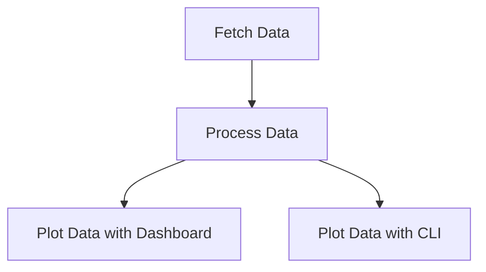

# What is Software Metrics Machine (SSM)?

Software Metrics Machine (SSM) is a comprehensive tool designed to provide actionable insights into the health and performance of software development teams. Unlike traditional methods that rely heavily on story points to measure progress, SSM focuses on data-driven metrics that reflect the true dynamics of software development processes.

## The Problem with Story Points

Story points have long been used as a measure of progress in Agile software development. However, they often fail to capture the complexities of real-world software projects. Story points:

- Are subjective, vary between teams and individuals and is used as a management to always [wanting more](https://ronjeffries.com/articles/019-01ff/story-points/Index.html).
- Do not account for team dynamics, waiting times, or code quality.
- Provide limited insights into technical debt, code churn, or pipeline health.

These limitations can lead to misaligned priorities, inefficiencies, and a lack of actionable feedback for improving
team performance.

## How SSM Solves This Problem

SSM addresses these challenges by offering a data-driven approach to software metrics. It collects and analyzes data from various sources, including:

- **Pipeline Metrics**: Tracks success rates and average completion times to ensure a stable and efficient development pipeline.
- **Pull Request Metrics**: Provides insights into the average time PRs remain open, helping teams identify bottlenecks and improve collaboration.
- **Git History Metrics**: Analyzes code churn, hotspots, and change frequency to highlight areas of technical debt and opportunities for improvement.

The process is:

By focusing on these metrics, SSM enables teams to:

- Make informed decisions based on real data rather than subjective estimates.
- Identify and address inefficiencies in the development process.
- Foster a culture of continuous improvement and collaboration.

### Providers

To accomplish SSM mission, this project is built based on a provider model, where each provider is responsible to extract
data from a specific source. This is because depending on the desired metric, it might come from a difference source. For
example, there are metrics extractd about coupling that are from the git log.

Other metrics such as pipeline execution and pull request open days average comes from GitHub API (or other providers).
Visit [supported providers](./supported-providers.md) for a full list of the metrics generated based on them.

## Why Join the SSM Project?

For new joiners and those unfamiliar with SSM, this project offers an opportunity to:

- Contribute to a tool that empowers software teams to deliver high-quality products more efficiently.
- Learn about advanced metrics and their applications in real-world scenarios.
- Be part of a community that values data-driven decision-making and continuous improvement.

Whether you're a developer, a project manager, or simply someone passionate about improving software development practices,
SSM provides the tools and insights you need to succeed.
